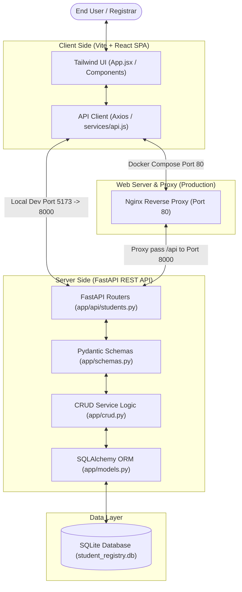

# Student Details Registry

A modern, high-performance, full-stack Student Details Registry designed for academic institutions to manage student enrollment, academic records, and profiles. Built using React (JS/JSX), Vite, Tailwind CSS, Python, FastAPI, SQLite, SQLAlchemy, and Pydantic.

This project was developed using a multi-agent autonomous engineering workflow powered by the **Google Antigravity SDK**, demonstrating modern AI-driven software development standards.

---

## 🚀 Key Features

- **Comprehensive CRUD Operations**: Fully reactive UI to create, view, edit, and permanently delete student profiles.
- **Advanced Querying & Filtering**: Dynamic server-side pagination, multi-column sorting, case-insensitive wildcard searches, and specific course & GPA filters.
- **Robust Multi-Layer Validation**: Strict data integrity rules enforced via Pydantic schemas on the backend (e.g., specific age limits, email domain restrictions, enrollment code formats) and synchronous state validation on the frontend.
- **Modern Responsive UI/UX**: Designed using Tailwind CSS and Lucide icons, featuring slide-in detail drawers, loading status indicators, and keyboard accessibility.
- **Seamless Dockerization**: Production-ready container orchestration via Docker Compose with a multi-stage frontend Docker build served by Nginx reverse proxy.
- **Automated QA Suite**: Extensive Python backend unit tests (Pytest) with an in-memory SQLite database, frontend Vitest service tests, and automatic GitHub Actions CI validation.

---

## 🛠️ Technology Stack

| Layer | Technology | Description |
| :--- | :--- | :--- |
| **Frontend** | React 18, Vite 5, JavaScript/JSX | Fast bundling, hot-module reloading, and declarative component state. |
| **Styling** | Tailwind CSS, Lucide Icons | Utility-first responsive design, modern UI patterns, and accessibility. |
| **State & API** | Axios, Debounced React Hooks | Optimized network integration with 250ms keystroke debouncing. |
| **Backend** | Python 3.11+, FastAPI | Extremely fast, asynchronous REST API with automatic OpenAPI Swagger generation. |
| **ORM** | SQLAlchemy | Relational database mapping using declarative models. |
| **Validation** | Pydantic v2 | High-performance type hints and constraint enforcement on incoming payloads. |
| **Database** | SQLite | Serverless, transactional SQL engine suited for local setups and simple scaling. |
| **Testing** | Pytest, Vitest | Comprehensive backend endpoint unit testing and frontend service mock verification. |
| **Docker** | Docker Compose, Nginx | Dynamic multi-container runtime, bridging network services, and static file serving. |

---

## 🏛️ System Architecture



> [!NOTE]
> For a deep dive into component roles, data flow sequence schemas, and detailed database mappings, consult the [docs/ARCHITECTURE.md](file:///Users/durgaprasadponukumati/.gemini/antigravity/scratch/student-details-registry/docs/ARCHITECTURE.md) blueprint.

---

## 🤖 AI Multi-Agent Development Team

This system was engineered by a team of collaborative, specialized autonomous subagents orchestrated by a **Scrum Master Agent** using the **Google Antigravity SDK**:

1. **Scrum Master Agent**: Establishes backlogs, coordinates handovers, resolves blocks, and manages PR reviews.
2. **Backend Developer Agent**: Designs relational tables, builds FastAPI endpoints, and models Pydantic schema rules.
3. **Frontend Developer Agent**: Constructs the React presentation layer, styled layouts, and client-side validations.
4. **QA/Testing Agent**: Authors Pytest backend suites, Vitest mock verifications, and enforces continuous integration standards.
5. **Documentation Writer Agent** *(Us)*: Architected and polished the documentation framework, plans, and guides.

Detailed agent interaction boundaries and messaging designs are available in [docs/AGENTS.md](file:///Users/durgaprasadponukumati/.gemini/antigravity/scratch/student-details-registry/docs/AGENTS.md).

---

## ⚡ Getting Started

Ensure you have **Docker** and **Docker Compose** installed for the easiest setup. Alternatively, you can install the stack locally with **Python 3.11+** and **Node.js 18+**.

### Option A: Run Instantly via Docker Compose (Recommended)

To compile the entire stack, mount the database storage volume, and launch the application in production mode:

```bash
# Clone the repository
git clone https://github.com/your-org/student-details-registry.git
cd student-details-registry

# Start the multi-container environment
docker-compose up --build
```

- The React SPA will be served at **[http://localhost](http://localhost)** (via Nginx on Port 80).
- The FastAPI server will be running on **[http://localhost:8000](http://localhost:8000)**.
- The SQLite DB will be persisted inside the local named volume `backend_data`.
- Interactive Swagger documentation is available at **[http://localhost:8000/docs](http://localhost:8000/docs)**.

To shut down and remove volumes:
```bash
docker-compose down -v
```

---

### Option B: Local Development Setup

> [!IMPORTANT]
> When opening the project in your IDE, recommend setting `/Users/durgaprasadponukumati/.gemini/antigravity/scratch/student-details-registry` as your active workspace.

#### Step 1: Configure the Backend

```bash
cd backend

# Create and activate Python virtual environment
python3 -m venv venv
source venv/bin/activate

# Install dependencies
pip install -r requirements.txt
```

The database tables are automatically initialized on server startup (`Base.metadata.create_all` in `main.py`). The application directory contains a pre-seeded SQLite database file `student_registry.db`.

To launch the FastAPI server locally:
```bash
uvicorn app.main:app --reload --port 8000
```
The server starts at **[http://127.0.0.1:8000](http://127.0.0.1:8000)**.

#### Step 2: Configure the Frontend

```bash
cd ../frontend

# Install node dependencies
npm install

# Run the Vite dev server
npm run dev
```

The React frontend launches on **[http://localhost:5173](http://localhost:5173)**. Requests to `/api/*` are dynamically proxied to `http://127.0.0.1:8000` via the Vite proxy configuration in `vite.config.js`.

---

## 📂 Documentation Map

Explore our detailed technical references under the `/docs` directory:

- 📄 **[docs/ARCHITECTURE.md](file:///Users/durgaprasadponukumati/.gemini/antigravity/scratch/student-details-registry/docs/ARCHITECTURE.md)**: Database schemas, component directories, entity descriptions, and request flows.
- 📄 **[docs/API_DOCUMENTATION.md](file:///Users/durgaprasadponukumati/.gemini/antigravity/scratch/student-details-registry/docs/API_DOCUMENTATION.md)**: Endpoint technical mappings, constraints, status codes, and Pydantic validation error structures.
- 📄 **[docs/AGENTS.md](file:///Users/durgaprasadponukumati/.gemini/antigravity/scratch/student-details-registry/docs/AGENTS.md)**: Multi-agent design, Google Antigravity communication buses, and task handover specs.
- 📄 **[docs/SPRINT_PLAN.md](file:///Users/durgaprasadponukumati/.gemini/antigravity/scratch/student-details-registry/docs/SPRINT_PLAN.md)**: Sprint execution history, mock logs, standup diaries, and release scopes.
- 📄 **[docs/CONTRIBUTING.md](file:///Users/durgaprasadponukumati/.gemini/antigravity/scratch/student-details-registry/docs/CONTRIBUTING.md)**: Code style regulations (PEP 8), testing guidelines (Pytest/Vitest), and PR instructions.

---

## ⚖️ License

Distributed under the MIT License. See `LICENSE` for details.
