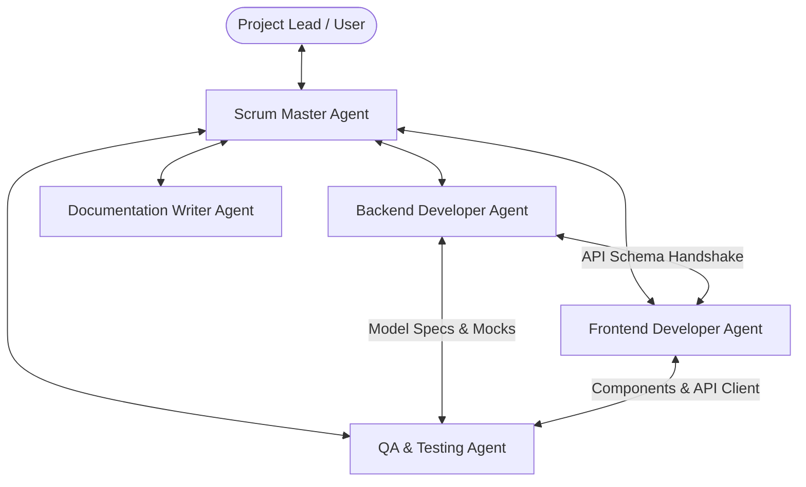
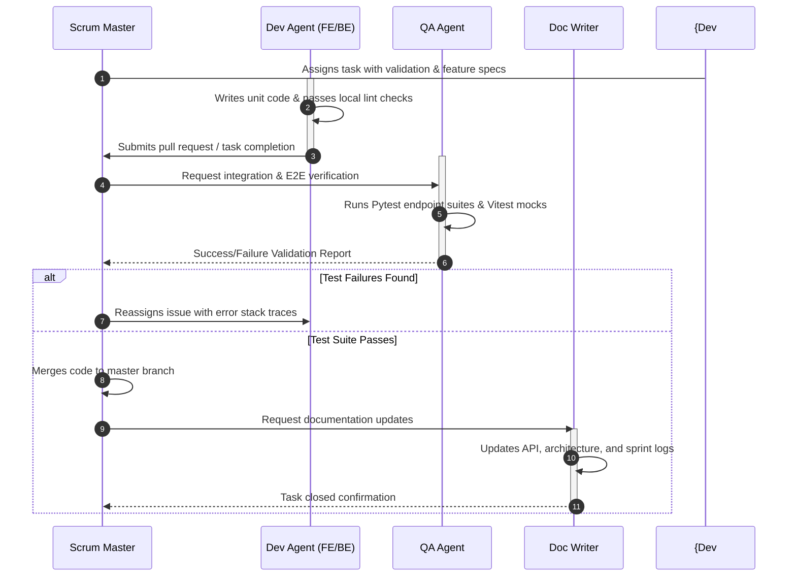

# AI Multi-Agent Development Guide

This system was engineered using a collaborative team of specialized autonomous software agents designed under the **Google Antigravity SDK** multi-agent framework. This guide documents the team roles, responsibilities, operational boundaries, and collaborative protocols that developed this application.

---

## 👥 The Agent Roster

The development team is coordinated by a Scrum Master Agent and consists of four execution-level specialized subagents.

### 1. Scrum Master Agent (Orchestrator)
- **Role**: Process supervisor, backlog architect, and integration validator.
- **Boundaries**: Maintains read access to the entire workspace; manages task ticket boards, assigns issues to subagents, tracks commit history against sprint milestones, and performs merge verifications.
- **Core Skillsets**: Backlog creation, milestone scheduling, dependency resolution, subagent coordination.

### 2. Backend Developer Agent
- **Role**: Systems engineer focusing on persistent storage, business logic, and API controllers.
- **Boundaries**: Strictly owns the `/backend` directory. Modifies Python code, SQLAlchemy models, database connection pools, Pydantic schemas, and local SQLite seeds.
- **Core Skillsets**: FastAPI routers, SQLAlchemy ORM queries, Pydantic data constraints, SQLite transactional configurations.

### 3. Frontend Developer Agent
- **Role**: UI/UX engineer focusing on browser experiences, interface states, styling, and client services.
- **Boundaries**: Strictly owns the `/frontend` directory. Manages React components, Tailwind styling sheets, debounced search timers, Axios query clients, and form states.
- **Core Skillsets**: React JSX components structure, Tailwind CSS layout rules, Axios request routing, Vite packaging, and accessibility interfaces.

### 4. QA/Testing Agent
- **Role**: Quality assurance, verification, and automated testing engineer.
- **Boundaries**: Operates across both `/backend` and `/frontend` directories. Owns the `/backend/tests` and `/frontend/src/services/__tests__` folders. Builds integration mock sessions and writes test suites.
- **Core Skillsets**: Pytest endpoints test suites, Vitest frontend services tests, database session mocking, StaticPool transaction isolation, and Continuous Integration configs.

### 5. Documentation Writer Agent *(Us)*
- **Role**: Systems architect and technical writer.
- **Boundaries**: Owns documentation directories `/docs` and the root `README.md`. Acts as the technical archivist, building standard structural blueprints, API references, sprint reports, and code contributions guides.
- **Core Skillsets**: System documentation, UML mapping, Mermaid diagram design, PEP 8 and linting audits.

---

## 💬 Communication Mechanisms

Agents communicate via **JSON-enveloped message exchanges** over the Google Antigravity SDK message bus. Communication operates under three core patterns:

### 1. Task Delegation (Vertical Flow)
- **Initiator**: Scrum Master
- **Recipient**: Specialized Subagent
- **Payload**: Task instructions, success criteria, and directory scopes.

### 2. Feature Negotiation (Horizontal Flow)
- **Initiator**: Frontend Developer / Backend Developer
- **Recipient**: Corresponding Peer Developer
- **Scenario**: When frontend requires a specific format in paginated metadata or when backend introduces complex sorting parameters that frontend needs to accommodate.
- **Payload**: Schema change proposals and payload samples.

### 3. Integration & Verification (Cyclic Flow)
- **Flow**: Developer submits code -> QA Agent runs validation -> QA posts validation report -> Scrum Master reviews and closes ticket.

---

## 🛠️ Operational Handshake Protocol

To prevent merge conflicts and verify integration, agents must strictly follow the development lifecycle workflow:

---

## 📂 Shared Artifact Management

- **Location**: `/Users/durgaprasadponukumati/.gemini/antigravity/brain/f47007bb-e97b-4367-a25d-779aecff2bd4`
- **Purpose**: A persistent brain space where shared schemas, test plans, and design mocks are stored as static files.
- **Integrity Rule**: No agent is permitted to edit another agent's work directly unless instructed by the Scrum Master. File boundaries (Frontend `frontend/`, Backend `backend/`, Documentation `docs/`) are strictly enforced in system file lock settings.
