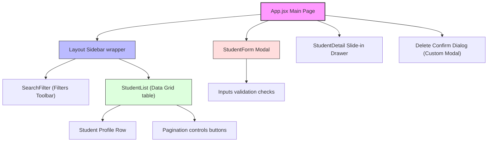

# Architecture & System Design Document

This document provides a comprehensive view of the system architecture, directory structures, database schema, data flow sequences, and component hierarchy of the **Student Details Registry**.

---

## 🏛️ System Overview

The Student Details Registry employs a classic decoupled **Client-Server Architecture** designed for speed, safety, and rapid deployment. It is fully containerized with Docker and served locally or in production.

```
+-------------------------------------------------------+
|                     Client (SPA)                      |
|                  React 18 + Vite 5                    |
+---------------------------+---------------------------+
                            |
                            | HTTP / REST APIs (Port 80 via Nginx proxy)
                            v
+-------------------------------------------------------+
|                  Application Server                   |
|                 Python 3.11+ + FastAPI                |
+---------------------------+---------------------------+
                            |
                            | SQLAlchemy ORM (Port 8000)
                            v
+-------------------------------------------------------+
|                     Data Storage                      |
|                 SQLite Database File                  |
+-------------------------------------------------------+
```

The system splits responsibilities into three cleanly decoupled layers:
1. **Presentation Layer**: Client application written in React, styled with Tailwind CSS, utilizing component states for query filtering and a services layout wrapper. In production, this layer is served as optimized static assets via Nginx.
2. **Application Logic Layer**: FastAPI REST API implemented in Python, taking advantage of asynchronous route handlers, dynamic database query matching, and strong schema validation through Pydantic.
3. **Data Access Layer**: Database queries managed by SQLAlchemy ORM, defining models using table-mapping columns and performing transactional CRUD operations on a local SQLite database file.

---

## 💻 Tech Stack Rationale

- **FastAPI (Python)**: High-performance, asynchronous web framework built on Starlette and Pydantic. Features automatic interactive Swagger UI generation (`/docs`).
- **SQLAlchemy ORM**: Flexible SQL mapping for Python, converting complex sorting, pagination, and filters into sanitized prepared SQL statements to prevent SQL Injection.
- **Pydantic v2**: Handles runtime data validation and serialization. Validates constraints on incoming request bodies, converting them to structured schemas and returning transparent 422 errors on failure.
- **SQLite**: Self-contained, serverless database engine. Ideal for development, automated in-memory testing, and simple institutional registries, avoiding external hosting overhead.
- **React & Vite 5**: High-speed hot-module replacement and asset compilation. Integrates seamlessly with Axios and custom React hooks.
- **Nginx & Docker Compose**: Simplifies deployment. Docker Compose mounts a database volume for backend persistence, while Nginx handles SPA history routing and proxies API requests seamlessly.

---

## 📂 Directory Structure

The project is structured as a mono-repository containing separate frontend (`frontend/`) and backend (`backend/`) directories to allow distinct execution and testing environments.

```
student-details-registry/
├── backend/                     # Backend REST API Application (Python + FastAPI)
│   ├── app/
│   │   ├── api/                 # API controllers
│   │   │   └── students.py      # FastAPI routes, queries & exception handlers
│   │   ├── config.py            # Environment configurations & project constants
│   │   ├── database.py          # SQLAlchemy engine, session local & get_db helper
│   │   ├── crud.py              # Repository database transaction layer
│   │   ├── models.py            # SQLAlchemy database table declaration
│   │   └── schemas.py           # Pydantic validation rules and responses
│   │   └── main.py              # Fast API application initialization
│   ├── tests/                   # Automated backend QA suite
│   │   ├── conftest.py          # Pytest in-memory DB setups & overrides
│   │   └── test_students.py     # Endpoint, validation, & transaction unit tests
│   ├── requirements.txt         # Backend Python packages catalog
│   ├── Dockerfile               # Backend Python slim deployment image containerizer
│   └── student_registry.db      # Local SQLite database file (automatically created)
│
├── frontend/                    # Frontend Application (React + Vite + Tailwind)
│   ├── src/
│   │   ├── components/          # Reusable shared UI components
│   │   │   ├── Layout.jsx       # Navigation sidebar and master view wrapper
│   │   │   ├── SearchFilter.jsx # Inputs toolbar (search, course, GPA, sorting)
│   │   │   ├── StudentList.jsx  # Pagination grid list and details table
│   │   │   ├── StudentForm.jsx  # Modal dialog managing creation & edit
│   │   │   └── StudentDetail.jsx# Slide-in profile view drawer
│   │   ├── services/            # API services integration layer
│   │   │   ├── __tests__/       # Frontend API mock test suite
│   │   │   │   └── api.test.js  # Vitest service specs
│   │   │   └── api.js           # Axios server connection layer and param pruning
│   │   ├── App.jsx              # Main tab controller, notifications & modals shell
│   │   ├── index.css            # Tailwind directives imports
│   │   └── main.jsx             # React UI bootstrap entrypoint
│   ├── public/                  # Public static assets
│   ├── package.json             # Node package manifest
│   ├── vite.config.js           # Vite development port and dev-proxy config
│   ├── tailwind.config.js       # Utility-first class styling overrides
│   ├── postcss.config.js        # PostCSS styles compiler configurations
│   ├── nginx.conf               # Web server config and API reverse-proxy map
│   └── Dockerfile               # Node stage 1 compiler & Nginx stage 2 hoster
│
├── docker-compose.yml           # Complete containerized stack orchestrator
└── docs/                        # Project architectural guides and schedules
```

---

## 🗄️ Database Schema

The database model revolves around the `Student` entity. The schema is constructed using SQLAlchemy declarative definitions.

### Database Entity Attributes

| Field Name | Data Type | Constraints / Attributes | Description |
| :--- | :--- | :--- | :--- |
| `id` | Integer | Primary Key, Auto-increment | Unique identifier for each student record. |
| `first_name` | String(50) | Not Null | First name of the student (length 2-50). |
| `last_name` | String(50) | Not Null | Last name of the student (length 2-50). |
| `email` | String(100) | Unique, Index, Not Null | University email address, ends with `@university.edu`. |
| `date_of_birth` | Date | Not Null | Date of birth, student must be >= 16 years old. |
| `enrollment_number`| String(50) | Unique, Index, Not Null | Institutional registration, format `XX-YYYY-ZZZZ`. |
| `course` | String(100) | Not Null | Enrolled academic discipline. |
| `gpa` | Float | Not Null | Grade Point Average, range `0.0` to `4.0`. |
| `created_at` | DateTime | Server Default: `now()`, Not Null | Datetime record was created. |
| `updated_at` | DateTime | Server Default: `now()`, Auto-update | Datetime record was last modified. |

### SQLAlchemy Model Definition

```python
from sqlalchemy import Column, Integer, String, Date, Float, DateTime
from sqlalchemy.sql import func
from .database import Base

class Student(Base):
    __tablename__ = "students"

    id = Column(Integer, primary_key=True, index=True, autoincrement=True)
    first_name = Column(String(50), nullable=False)
    last_name = Column(String(50), nullable=False)
    email = Column(String(100), unique=True, index=True, nullable=False)
    date_of_birth = Column(Date, nullable=False)
    enrollment_number = Column(String(50), unique=True, index=True, nullable=False)
    course = Column(String(100), nullable=False)
    gpa = Column(Float, nullable=False)
    created_at = Column(DateTime(timezone=True), server_default=func.now(), nullable=False)
    updated_at = Column(
        DateTime(timezone=True), 
        server_default=func.now(), 
        onupdate=func.now(), 
        nullable=False
    )
```

---

## 🔄 Sequence Flows

### 1. Creating a Student Record (Success Path)

```mermaid
sequenceDiagram
    autonumber
    actor Admin as Registrar (Browser UI)
    participant Front as React Form Modal
    participant FastAPI as FastAPI Router
    participant Pydantic as Pydantic Validator
    participant CRUD as CRUD Repository
    participant Session as SQLAlchemy Session
    database DB as SQLite (File)

    Admin->>Front: Inputs fields and clicks Submit
    Note over Front: Verifies age >= 16, email domain, GPA range, & enrollment format
    Front->>FastAPI: POST /api/v1/students/ { payload }
    FastAPI->>Pydantic: Validate StudentCreate schema (payload)
    Pydantic-->>FastAPI: Valid Pydantic Schema Instance
    FastAPI->>CRUD: Check email & enrollment conflicts
    FastAPI->>CRUD: create_student(db_session, student_schema)
    CRUD->>Session: Instantiate Student DB model & Add
    Session->>DB: INSERT INTO students VALUES (...)
    DB-->>Session: Database row added
    Session->>Session: commit() & refresh()
    Session-->>CRUD: Refreshed DB Model
    CRUD-->>FastAPI: Student Database Object
    FastAPI-->>Front: HTTP 201 Created { JSON response }
    Front-->>Admin: Show success notification toast & reload registry grid
```

### 2. Fetching Paginated & Filtered Student List

```mermaid
sequenceDiagram
    autonumber
    actor Admin as Registrar (Browser UI)
    participant UI as React List Page
    participant Client as Axios Service Client
    participant FastAPI as FastAPI Router
    participant CRUD as CRUD Repository
    database DB as SQLite (File)

    Admin->>UI: Types Search term, selects course filter, sets GPAs, changes sorting
    Note over UI: 250ms Debounced Keystroke delay fires
    UI->>Client: getStudents(page=1, limit=10, search, course, minGpa, maxGpa, sortBy, sortOrder)
    Note over Client: Prunes empty filters & default "All Courses" and converts GPAs to floats
    Client->>FastAPI: GET /api/v1/students/?skip=0&limit=10&search=Alice&course=CS&min_gpa=3.0&max_gpa=4.0&sort_by=gpa&sort_order=desc
    FastAPI->>CRUD: get_students(db, skip=0, limit=10, search="Alice", course="CS", min_gpa=3.0, max_gpa=4.0, sort_by="gpa", sort_order="desc")
    Note over CRUD: Applies filters, runs case-insensitive ILIKE wildcards on name/email/enrollment, checks valid sort keys
    CRUD->>DB: SELECT COUNT(*) & SELECT * FROM students ... LIMIT 10 OFFSET 0
    DB-->>CRUD: items list & total count integer
    CRUD-->>FastAPI: Tuple (items, total)
    FastAPI-->>Client: HTTP 200 OK { items: StudentResponse[], total: 5, skip: 0, limit: 10 }
    Client-->>UI: Cache and update local component state
    UI-->>Admin: Renders sorted registry datagrid with pagination controls
```

---

## 🧩 Frontend Component Architecture

The frontend leverages a tree of reusable presentation components wrapped in layout panels.



---

## 🛡️ Validation & Security Framework

- **Dual-Layer Validation**: Client validation provides instant UX feedback using HTML5 and React states. Backend validation guarantees database integrity through Pydantic's type constraints.
- **Exception and Conflict Handling**: Explicit FastAPI exceptions are raised for data conflicts. For example:
  - Returning **HTTP 409 Conflict** if an email or enrollment number already exists.
  - Returning **HTTP 404 Not Found** if a record does not exist on edit/delete actions.
- **SQL Injection Prevention**: The database layer uses SQLAlchemy query constructs rather than raw SQL strings, neutralizing SQL injection vectors.
- **CORS Configuration**: In local environments, the backend includes `CORSMiddleware` restricted to registered development ports. In Docker production environments, the frontend container acts as a reverse proxy, eliminating cross-origin errors by serving the SPA and proxying API endpoints over Port 80 under a single domain.
- **Concurrency & Thread Safety**: Using thread-safe scoped SQLite connection configurations (`check_same_thread=False` and SQLAlchemy session controls) ensures operations do not collide.
